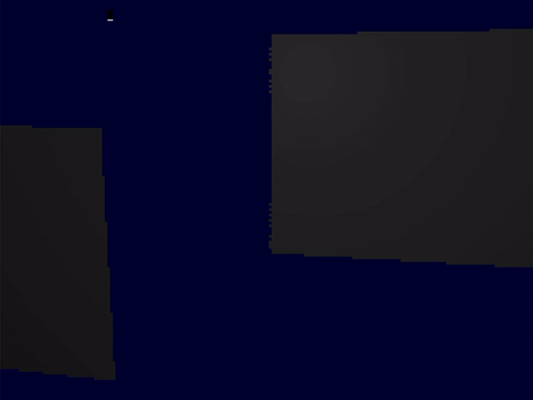

# raytracer

A one-file raytracer that draws into the linux framebuffer. 

Has lights, shadows, reflection and refraction. 
Doesn't use any external frameworks or libraries, just the standard c and linux headers.

How to run it :

Compile the file : 'gcc raytrace.c -lm -o raytrace'

And then run it : './raytrace'

On some linux distros you may need root access rights to access the framebuffer, this case type : 'sudo ./raytrace'

If you don't see anything you probably have to switch to console mode because your window manager interferes with your framebuffer. Just switch to a console with CTRL+ALT+F1.

Check out the tutorials how to create this step-by-step :

